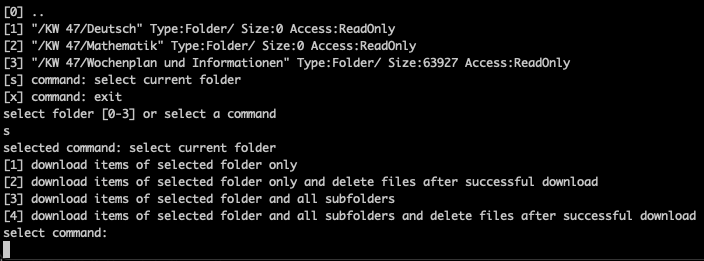

# SF-Downloader
    

SF-Downloader dient für den vereinfachten Umgang mit vielen Dateien in Schoolfox - FoxDrive

## Beschreibung

FD-Downloader ist ein Kommandozeilenprogramm geschrieben in Go <https://golang.org/>.
Bei der Veröffentlichung ([Releases](<https://github.com/omski/SF-Downloader/releases>)) neuer Versionen werden ausführbare Versionen für die Betriebssysteme Windows, MacOS und Linux erstellt.

## Anleitung

* Nach dem Start des Programm fordert es zur Eingabe des Schoolfox Benutzernamens und Passworts auf. 

* Anschließend wird eine Liste des 'Inventars' dargestellt.
Das Programm fordert zur Auswahl eines Inventareintrags aus. 

Es werden nun alle Einträge des FoxDrive Hauptverzeichnisses (root) dargestellt.
Man kann nun in Unterverzeichnisse navigieren oder das aktuell dargestellte Verzeichnis auswählen. 

* Nachdem ein Verzeichnis ausgewählt wurde besteht die Option: 
1 - die Dateien des ausgewählten Verzeichnisses herunterzuladen 
2 - die Dateien des ausgewählten Verzeichnisses und aller Unterverzeichnisse herunterzuladen 
3 - die Dateien des ausgewählten Verzeichnisses herunterzuladen und nach erfolgreichem Download auf Foxdrive zu löschen 
4 - die Dateien des ausgewählten Verzeichnisses und aller Unterverzeichnisse herunterzuladen und nach erfolgreichem Download auf Foxdrive zu löschen 

* Nach Ausführung des Kommandos wird das Programm beendet. 

## geplante Features

Zyklisches Ausführen des gewählten Kommandos um das gewählte Verzeichnis über einen längeren Zeitraum automatisch zu synchronisieren.
