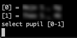

# SF-Downloader
    

SF-Downloader dient für den vereinfachten Umgang mit vielen Dateien in Schoolfox - FoxDrive

## Beschreibung

FD-Downloader ist ein Kommandozeilenprogramm geschrieben in Go <https://golang.org/>.</br>
Bei der Veröffentlichung ([Releases](<https://github.com/omski/SF-Downloader/releases>)) neuer Versionen von SF-Downloader werden ausführbare Dateien für die Betriebssysteme Windows, MacOS und Linux erstellt.


Auf Linux und MacOS muss die heruntergeladene ausführbare Datei noch mit dem Befehl [`chmod`](https://de.wikipedia.org/wiki/Chmod) im Terminal ausführbar gemacht werden:
```
chmod +x <Pfad zur heruntergeladenen Datei>
```


## Anleitung

* Nach dem Start des Programm fordert es zur Eingabe des Schoolfox Benutzernamens und Passworts auf.</br>

* Anschließend wird eine Liste des 'Inventars' dargestellt.
Das Programm fordert zur Auswahl eines Inventareintrags (Klassen, Personen, Schüler) aus.</br>

* Es werden nun alle Einträge des FoxDrive Hauptverzeichnisses (root) dargestellt.
Man kann nun in Unterverzeichnisse navigieren oder das aktuell dargestellte Verzeichnis auswählen. Es ist auch möglich das FoxDrive Hauptverzeichnis auszuwählen.</br>

* Nachdem ein Verzeichnis ausgewählt wurde besteht die Option:</br>
1 - die Dateien des ausgewählten Verzeichnisses herunterzuladen</br>
2 - die Dateien des ausgewählten Verzeichnisses und aller Unterverzeichnisse herunterzuladen</br>
3 - die Dateien des ausgewählten Verzeichnisses herunterzuladen und nach erfolgreichem Download auf Foxdrive zu löschen (löscht nur in Abgabe Ordern und nicht ReadOnly Dateien)</br>
4 - die Dateien des ausgewählten Verzeichnisses und aller Unterverzeichnisse herunterzuladen und nach erfolgreichem Download auf Foxdrive zu löschen (löscht nur in Abgabe Ordern und nicht ReadOnly Dateien)</br>

* Nach Ausführung des Kommandos besteht die die Wahl zwischen folgenden Optionen:</br>
1 - Speichern des aktuellen Zustands. Das Programm wird danach beendet. Der Programmstatus wird in einer Datei, namens '.fd-downloader_state', im gleichen Verzeichnis gespeichert in dem sich SF-Downloader befindet. Der gespeicherte Status wird beim nächsten Start des Programms automatisch geladen. Der ausgewählte Inventareintrag, die Ablage und das gewählte Kommando werden sofort nach dem Start ausgewählt und ausgeführt. Sollte der Login abgelaufen sein, fordert das Programm zu einem erneuten Login auf.</br>
2 - Löschen des gespeicherten Zustands. Das Programm wird danach beendet.</br>
3 - Wiederholen des gewählten Kommandos alle 15 Minuten</br>
4 - Beenden des Programms</br>


## geplante Features

--
## Haftungsausschluss

Die Nutzung von SF-Downloader geschieht auf eigenes Risiko.
Für Fehler, die durch die Nutzung dieses Tools entstehen, wird keine Haftung durch den Autor übernommen.
